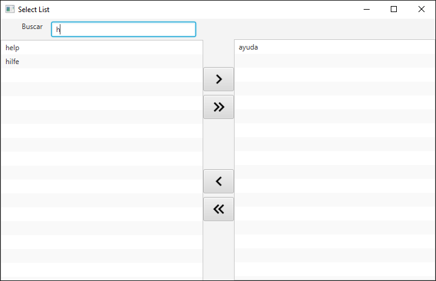

# FXListSelection
 FX component List selection of items bound for another list. It offers search field on the start list

Intenacionalizado, 

Selecciona cualquier tipo de dato



Ejemplo

```java
        
        List<String> list = new ArrayList<String>();
        list.add("help");
        list.add("ayuda");
        list.add("aider");
        list.add("hilfe");
        ObservableList<String> observableList = FXCollections.observableList(list);
        
       FXListSelection<String> listSelection = new FXListSelection<>();
       listSelection.setItems(observableList);
        stage.setScene(new Scene(listSelection));
        stage.setTitle("Select List");
        stage.show();
```

Ejemplo del filtro
```java
            listSelection.getSearchText().textProperty().addListener(obs -> {  
            String filter = listSelection.getSearchText().getText();
            if (filter == null || filter.length() == 0) {
                listSelection.getFilteredList().setPredicate(s -> true);
            } else {
                listSelection.getFilteredList().setPredicate(s -> s.toUpperCase().contains(filter.toUpperCase()));
            }
            });
```
